# **The Walking Dead Exploratory Data Analysis**

## **Introduction**

  

The Walking Dead is an American zombie horror television series produced by [**AMC**](https://en.wikipedia.org/wiki/AMC_Networks). The show is based on acclaimed comic book series created by Robert Kirkman (also known for Invencible, Outacst, Oblivion Song ...), which follows a group of survivors led by former sheriff's deputy **Rick Grimes** as they navigate the dangers of this new world, including not only the relentless threat of the undead but also conflicts with other survivors, internal power struggles, and the struggle to maintain their humanity in the face of unimaginable horror.  

The series premiered on **October 31, 2010** and ended it's run with the **11th** and **final** season on **November 20, 2022** ending series after **177 episodes**. During it's 11 seasons The Walking Dead gained massive and supportive fanbase that is still engaged in the world of The Walking Dead. Based on a huge success creators developed to this date (May, 2024) **six other spin-off shows** like Fear The Walking Dead, The Walking Dead Dead City or The Walking Dead The Ones Who Live.  

## Objective
The objective of this project was to conduct an exploratory analysis of the popular television series **The Walking Dead**. Through this analysis, I aimed to gain insights into various aspects of the show, including its episode ratings, viewership trends or directors, writers ratings across seasons.

## Table of content
- 📖 [Introduction](#introduction)
- 🎯 [Objective](#objective)
- ⚙️ [Data source](#data-source)
  - 📺 [Episodes](#episodes)
  - ⭐ [IMDB](#imdb)
- 🧹 [Data Cleaning And Preparation](#data-cleaning-and-preparation)
  - 📚 [Importing Libraries](#importing-libraries)
  - 📁 [Preparing Dataset](#preparing-dataset)
  - 🔎 [Observing And Cleaning](#observing-and-cleaning)
- 📈 [Analysis](#analysis)
  - 📊 [Episodes](#episodes)
  - ⭐ [IMDB Rating](#imdb-rating)
  - 🔭[US Viewership](#us-viewership)
  - 📅 [Release Date Trends](#release-date-trends)
  - 📣 [Directors Within The Series](#directors-within-the-series)
  - ✍️ [Writers Within The Series](#writers-within-the-series)
  - 📙 [Episode Synopsis](#episode-synopsis)
- 🔮 [Conclusion And Future Work](#conclusion-and-future-work)
- 🙏 [Acknowledgement](#Acknowledgement)
- 🌐 [Used Sources](#used-sources)

## Data Source
For this analysis I used dataset [The Walking Dead Episodes](https://www.kaggle.com/datasets/bcruise/the-walking-dead-episodes/data) (CC0: Public Domain, dataset made available through [Bill Cruise](https://www.kaggle.com/bcruise)).  
The dataset consists of two **.csv** files in total. Both files share some common data, but they also exhibit differences.

### Episodes

The first file is **the_walking_dead_episodes.csv**, which contained a total of **eight** columns.

| **Column #**   | **Column Name**       | **Description**          | **Column #**    | **Column Name**    | **Description**                 |
|----------------|-----------------------|--------------------------|-----------------|--------------------|---------------------------------|
| **0**          | season                | season                   | **4**           | directed_by        | director(s) of the episode      |
| **1**          | episode_num_in_season | episode number in season | **5**           | written_by         | writter(s) of the episode       |
| **2**          | episode_num_overall   | episode number in series | **6**           | original_air_date  | original air date               |
| **3**          | title                 | title of the episode     | **7**           | us_viewers         | US viewers on original air date |

### IMDB

The second file **the_walking_dead_imdb.csv**, had fewer columns than the previous one, only **seven**.

| **Column #**   | **Column Name**       | **Description**          | **Column #**    | **Column Name**    | **Description**                                             |
|----------------|-----------------------|--------------------------|-----------------|--------------------|-------------------------------------------------------------|
| **0**          | season                | season                   | **4**           | imdb_rating        | average IMDB rating                                         |
| **1**          | episode_num_in_season | episode number in season | **5**           | total_votes        | total number of votes that <br>the IMDB rating was based on |
| **2**          | title                 | title of the episode     | **6**           | desc               | episode synopsis                                            |
| **3**          | original_air_date     | original air date        |                 |                    |                                                             |

## Data Cleaning And Preparation

Before starting the analysis in **Python**, I reviewed both files in **Excel**. Since both files have the same structure and share most of the columns, I decided to merge them before diving into the analysis.  
  
### Importing Libraries

I began by importing the necessary Python libraries and packages for my project.  

```python
# Importing libraries and functions
import pandas as pd
import numpy as np
import matplotlib.pyplot as plt
import matplotlib.ticker as ticker
from wordcloud import WordCloud, STOPWORDS
```

### Preparing Dataset

Then, I loaded both files into **dataframes**, naming them `episodes` and `imdb`. After that, I merged the two dataframes into one because I knew which columns each file had, and it was more efficient to combine them rather than have them separated.

```python
# Creating dataframes
episodes = pd.read_csv('the_walking_dead_episodes.csv')
imdb = pd.read_csv('the_walking_dead_imdb.csv')

# Merged dataframe
twd_dataset = pd.merge(episodes, imdb)
```

Once the dataframes were merged into a single dataset, I checked the resulting dataframe to ensure everything was correct.

```python
# Getting shape of dataframe
twd_dataset.shape

Output:
(177,12)
```

```python
# Display first 5 rows of dataframe
twd_dataset.head()

Output:
| season | episode_num_in_season | episode_num_overall | title                | directed_by           | written_by                                  | original_air_date | us_viewers  | episode_num | imdb_rating | total_votes | desc                                              |
|--------|-----------------------|---------------------|----------------------|-----------------------|---------------------------------------------|-------------------|-------------|-------------|-------------|-------------|---------------------------------------------------|
| 1      | 1                     | 1                   | Days Gone Bye        | Frank Darabont        | Teleplay by: Frank Darabont                 | 2010-10-31        | 5350000.0   | 1           | 9.2         | 27463       | Deputy Sheriff Rick Grimes awakens from a coma... |
| 1      | 2                     | 2                   | Guts                 | Michelle MacLaren     | Frank Darabont                              | 2010-11-07        | 4710000.0   | 2           | 8.6         | 17278       | In Atlanta, Rick is rescued by a group of surv... |
| 1      | 3                     | 3                   | Tell It to the Frogs | Gwyneth Horder-Payton | Story by: Charles H. Eglee & Jack LoGiudice | 2010-11-14        | 5070000.0   | 3           | 8.2         | 15815       | Rick is reunited with Lori and Carl but soon d... |
| 1      | 4                     | 4                   | Vatos                | Johan Renck           | Robert Kirkman                              | 2010-11-21        | 4750000.0   | 4           | 8.5         | 15449       | Rick, Glenn, Daryl and T-Dog come across a gro... |
| 1      | 5                     | 5                   | Wildfire             | Ernest Dickerson      | Glen Mazzara                                | 2010-11-28        | 5560000.0   | 5           | 8.1         | 14856       | After the attack on the camp, Rick leads the s... |

```
The dataset at that point had **177 rows** and **12 columns**. The number of rows was correct, but I noticed that there were two columns with the same type of data: `episode_num_in_season` and `episode_num`. Since both served the same purpose, I decided to drop one of them to keep the dataset clean. After removing the redundant column, I checked again to ensure the row count changed.

```python
# Removing row from dataset
twd_dataset = twd_dataset.drop(['episode_num'], axis= 'columns')

# Getting shape of dataframe after removing column
twd_dataset.shape

Output:
(177, 11)
```

I also decided to rename the `desc` column, which contained the episode's synopsis, to `episode_synopsis` for clearer naming.

```python
# Renaming column
twd_dataset.rename(columns = {'desc': 'episode_synopsis'}, inplace = True)
```

### Observing And Cleaning

At this point, the dataset was ready, so I took a closer look to spot any errors, inconsistencies, or odd values. First, I checked some basic information about the dataset.

```python
# Getting basic dataframe informations
twd_dataset.info()

Output:
<class 'pandas.core.frame.DataFrame'>
Int64Index: 177 entries, 0 to 176
Data columns (total 11 columns):
 #   Column                 Non-Null Count  Dtype  
---  ------                 --------------  -----  
 0   season                 177 non-null    int64  
 1   episode_num_in_season  177 non-null    int64  
 2   episode_num_overall    177 non-null    int64  
 3   title                  177 non-null    object 
 4   directed_by            177 non-null    object 
 5   written_by             177 non-null    object 
 6   original_air_date      177 non-null    object 
 7   us_viewers             177 non-null    float64 
 8   imdb_rating            177 non-null    float64
 9  total_votes            177 non-null    int64  
 10  desc                   177 non-null    object 
dtypes: float64(2), int64(5), object(5)
memory usage: 22.0+ KB
```

**Observations:**
- the dataset had **177 rows** and **11 columns**
- **none** of the columns had **empty fields**
- `original_air_date` and `us_viewers` had **incorrect data types**

```python
# Checking for duplicate entries
twd_dataset.duplicated().sum()

Output:
0
```

**Observation:**  
- dataset had **0** duplicate rows

```python
# Information about numerical columns
display(twd_dataset.describe())

Output:
|           | season     | episode_num_in_season | episode_num_overall | us_viewers   | imdb_rating | total_votes  |
|-----------|------------|-----------------------|---------------------|--------------|-------------|--------------|
| count     | 177.000000 | 177.000000            | 177.000000          | 1.770000e+02 | 177.000000  | 177.000000   |
| mean      | 6.711864   | 9.135593              | 89.000000           | 8.137966e+06 | 7.915819    | 11266.056497 |
| std       | 3.078799   | 5.490046              | 51.239633           | 4.581610e+06 | 0.816922    | 5123.780686  |
| min       | 1.000000   | 1.000000              | 1.000000            | 1.190000e+06 | 4.100000    | 4325.000000  |
| 25%       | 4.000000   | 5.000000              | 45.000000           | 3.660000e+06 | 7.400000    | 7653.000000  |
| 50%       | 7.000000   | 9.000000              | 89.000000           | 7.920000e+06 | 7.900000    | 11220.000000 |
| 75%       | 10.000000  | 13.000000             | 133.000000          | 1.238000e+07 | 8.500000    | 13039.000000 |
| max       | 11.000000  | 24.000000             | 177.000000          | 1.729000e+07 | 9.600000    | 42427.000000 |
```

**Observations:**  
- seasons ranged from **1** to **11**
- episodes in ranged from **1** to **177**

```python
# Information about non numerical columns
display(twd_dataset.describe(include = 'object'))

Output:
|               | title          | directed_by     | written_by   | episode_synopsis                                     |
|---------------|----------------|-----------------|--------------|------------------------------------------------------|
| count         | 177            | 177             | 177          | 177                                                  |
| unique        | 177            | 55              | 69           | 177                                                  |
| top           | Days Gone Bye  | Greg Nicotero   | Angela Kang  | Deputy Sheriff Rick Grimes awakens from a coma...    |
| freq          | 1              | 37              | 15           | 10                                                   |
```

**Observations:**  
**Please Note:** 
I discovered in subsequent steps that the names of some directors are not standardized (due to different writing conventions), so consider this a preliminary look at the data, not a final description of the string columns.
- a total of **69** different writers or colaborative teams of writers participated in the show
- a total of **55** different directors or colaborative teams of directors participated in the show
- **Greg Nicotero** directed the most episodes, with a total of **37**
- **Angela Kang** wrote most episodes, with a total of **15**

```python
# Checking for NULL or NA values
twd_dataset.isna().apply(pd.Series.value_counts)

Output:
| season | episode_num_in_season | episode_num_overall | title | directed_by | written_by | original_air_date | us_viewers  | imdb_rating | total_votes | episode_synopsis |
|--------|-----------------------|---------------------|-------|-------------|------------|-------------------|-------------|-------------|-------------|------------------|
| False  | 177                   | 177                 | 177   | 177         | 177        | 177               | 177         | 177         | 177         | 177              |
```

**Observations:**  
- **none** of the columns had **NaN** or **NULL** values
  
As mentioned above, the `original_air_date` and `us_viewers` columns had incorrect data types. So, I decided to change the `original_air_date` data type from `object` to `datetime64[ns]` and the `us_viewers` data type to `int`.

```python
# Changing data types
twd_dataset['us_viewers'] = twd_dataset['us_viewers'].astype('int')
twd_dataset['original_air_date'] = pd.to_datetime(twd_dataset['original_air_date'])
```

```python
# Verifying data types
twd_dataset.dtypes

Output:
season                            int64
episode_num_in_season             int64
episode_num_overall               int64
title                            object
directed_by                      object
written_by                       object
original_air_date        datetime64[ns]
us_viewers                        int64
imdb_rating                     float64
total_votes                       int64
episode_synopsis                 object
dtype: object
```

Before proceeding with the actual analysis, I examined the values stored in the columns and checked how many unique values each column had to ensure I wouldn't jeopardize the analysis by skipping this important step.  
**Please Note:**  
The code output was too long to include here, but it is available in the Jupyter notebook in this [repository](https://github.com/analystOllie/The-Walking-Dead-Advanced-EDA/blob/main/TWD_EDA.ipynb).

```python
# Displaying number of unique values from each column with values
cols = twd_dataset.columns.tolist()

for stat in cols:
  print('\n' + str(stat))
  print(twd_dataset[stat].unique())
  print('Number of unique: ' + str(twd_dataset[stat].nunique()))
```

**Observations:**
- **11** unique seasons
- **24** unique episode numbers
- **177** unique episodes
- **177** unique titles
- **55** unique directors (with **one badly formatted** record)
- **69** unique writters (**9** needed **correction**)
- inconsistent use of **"&"** and **"and"** in `directed_by` and `written_by` columns
- **176** unique dates
- **162** unique numbers of viewers
- **35** unique IDMB average ratings
- **176** different vote counts
- and last **177** unique synopses

A few things needed to be updated and changed before analyzing the data. I discovered that there were **176** unique dates when episodes aired, which seemed strange. A quick search revealed that episodes **2x8** and **2x9** aired on the **same day**.  

I took the time to closely observe the writers' and directors' names to identify any errors or issues. First, I noticed that the `written_by` and `directed_by` columns had some value errors that needed fixing. I addressed the inconsistent use of **&** and **and** in rows where the episode was written by more than one writer. I decided to use **and**, but **&** would also work for this purpose.

```python
# Setting same conjunction between writters
twd_dataset['written_by'].replace('&', 'and', inplace = True, regex = True)
```

The second issue that needed fixing was a value in the `directed_by` column where the names were not separated, so I changed that to use the **and** conjunction.

```python
# Separating names of rirectors
twd_dataset.loc[twd_dataset['directed_by'] == 'Ernest DickersonGwyneth Horder-Payton', 'directed_by'] = 'Ernest Dickerson and Gwyneth Horder-Payton'
```

The third problem involved the name **David Leslie Johnson**, which sometimes appeared as **David Leslie Johnson-McGoldrick**. After a few checks on IMDb, I confirmed that it was the same person with an updated name. I made sure to correct this, along with fixing all remaining incorrect uses of **&** and **and** in the `written_by` column.

```python
# Fixing name
twd_dataset.loc[twd_dataset['written_by'] == 'David Leslie Johnson', 'written_by'] = 'David Leslie Johnson-McGoldrick'

# Setting same conjunction between remaining writters
twd_dataset.loc[twd_dataset['written_by'] == 'Teleplay by: Frank Darabont', 'written_by'] = 'Frank Darabont'
twd_dataset.loc[twd_dataset['written_by'] == 'Story by: Angela KangTeleplay by: Corey Reed and Jim Barnes', 'written_by'] = 'Angela Kang and Corey Reed and Jim Barnes'
twd_dataset.loc[twd_dataset['written_by'] == 'Story by: Charles H. Eglee and Jack LoGiudiceTeleplay by: Charles H. Eglee and Jack LoGiudice and Frank Darabont', 'written_by'] = 'Charles H. Eglee and Jack LoGiudice and Frank Darabont'
twd_dataset.loc[twd_dataset['written_by'] == 'Story by: Corey ReedTeleplay by: Corey Reed and Kevin Deiboldt', 'written_by'] = 'Corey Reed and Kevin Deiboldt'
twd_dataset.loc[twd_dataset['written_by'] == 'Story by: Jim Barnes and Eli Jorné and Corey ReedTeleplay by: Corey Reed', 'written_by'] = 'Jim Barnes and Eli Jorné and Corey Reed'
twd_dataset.loc[twd_dataset['written_by'] == 'Story by: Scott M. Gimple and Channing PowellTeleplay by: Channing Powell', 'written_by'] = 'Scott M. Gimple and Channing Powell'
twd_dataset.loc[twd_dataset['written_by'] == 'Story by: Scott M. Gimple and David Leslie Johnson-McGoldrick and Angela KangTeleplay by: David Leslie Johnson-McGoldrick and Angela Kang', 'written_by'] = 'Scott M. Gimple and David Leslie Johnson-McGoldrick and Angela Kang'
twd_dataset.loc[twd_dataset['written_by'] == 'Story by: Scott M. Gimple and Matthew NegreteTeleplay by: Matthew Negrete', 'written_by'] = 'Scott M. Gimple and Matthew Negrete'
```

I could have implemented these changes with custom functions, but I felt that devising a programming solution instead of manually replacing values would take too much time. After making all the necessary changes, the number of writers decreased from **69** to **66**, while the number of directors remained **unchanged**. With the dataset finally clean and ready for analysis, I saved it before proceeding.  

```python
# Saving dataframe into .csv
twd_dataset.to_csv('TWD_dataset.csv', encoding = 'utf-8', index = False)
```
## Analysis

### Episodes
I strated analyzing this dataset with simple things: 
- epiosde distribution
- average episode number for the series per season

**Episode Distribution**  
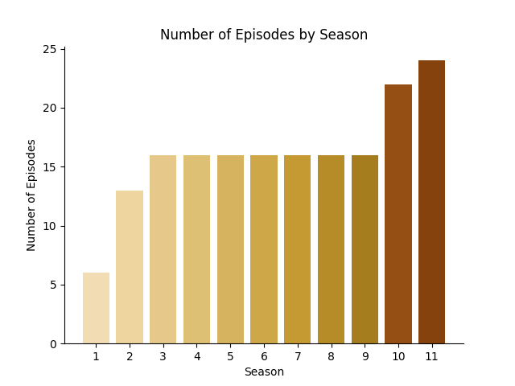  
```python
# Average episode numbe per season
print((twd_dataset['episode_num_overall'].max()/twd_dataset['season'].max()).round(2))

Output:
16.09
```
**Observations:**
- **16** episodes per season except for season **one** with **6**, **10** with **22** and **11** with **24** episodes
- the average number of episodes per season is was **16.09**

### IMDB Rating
Given that this analysis focuses on a TV series, it's important to examine the IMDb ratings, which represent viewers' ratings of the episodes.  
I analyzed the following aspects associated with IMDb ratings:
- average rating of the series
- rating distribution
- best and worst episodes
- ratings across the series
- ratings in seasons
- changes in ratings throughout seasons and the series as a whole
- average rating of the seasons, including gaps between the best and worst episodes

**Average IMDB Rating**
```python
# Average IMDB rating
print(twd_dataset['imdb_rating'].mean().round(2))

Output:
7.92
``` 
**Average IMDB Ratings Per Season**  
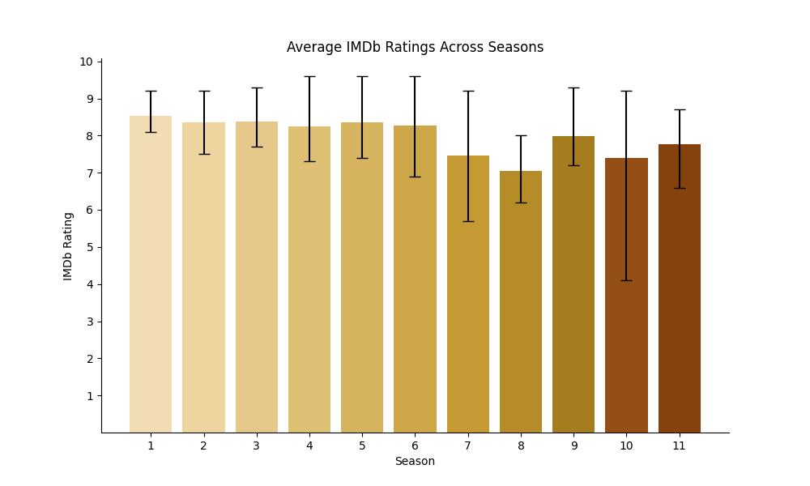  

**IMDB Rating Distribution**

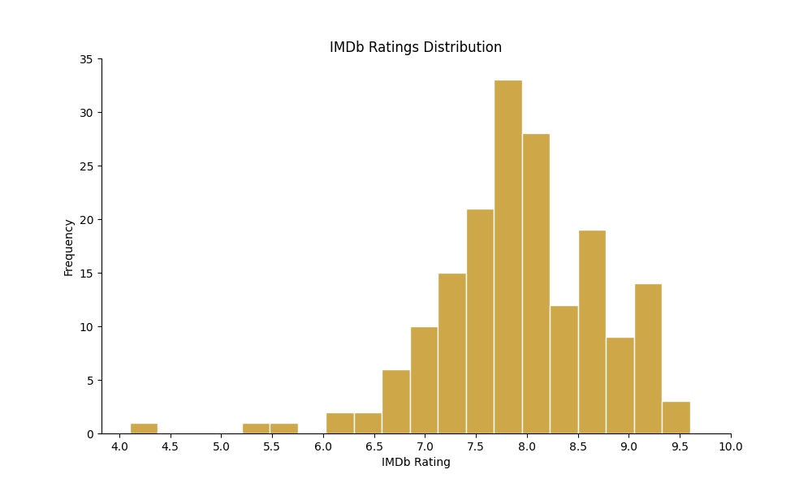  

**Please Note:** For best and worst rated episodes I decide to inluclude **top 15** from each group. Since most episodes fell between **7** and **8** in ratings, it was reasonable to limit the selection to the top 15 from each group. Otherwise, it would simply be a reflection of the number of average-rated episodes.  

**Best Rated Episodes**  
```python
| season | episode_num_in_season | title                                | original_air_date | imdb_rating |
|--------|-----------------------|--------------------------------------|-------------------|-------------|
| 5      | 1                     | No Sanctuary                         | 2014-10-12        | 9.6         |
| 4      | 8                     | Too Far Gone                         | 2013-12-01        | 9.6         |
| 6      | 9                     | No Way Out                           | 2016-02-14        | 9.6         |
| 9      | 15                    | The Calm Before	                    | 2019-03-24        | 9.3         |
| 3	     | 4                     | Killer Within                        | 2012-11-04        | 9.3         |
| 1      | 1                     | Days Gone Bye                        | 2010-10-31        | 9.2         |
| 2      | 13                    | Beside the Dying Fire                | 2012-03-18        | 9.2         |
| 4      | 14                    | The Grove                            | 2014-03-16        | 9.2         |
| 5      | 16                    | Conquer	                            | 2015-03-29        | 9.2         |
| 6      | 2                     | JSS                                  | 2015-10-18        | 9.2         |
| 6      | 3                     | Thank You                            | 2015-10-25        | 9.2         |
| 7	     | 1                     | The Day Will Come When You Won't Be  | 2016-10-23        | 9.2         |
| 9      | 5                     | What Comes After                     | 2018-11-04        | 9.2         |
| 2      | 7                     | Pretty Much Dead Already             | 2011-11-27        | 9.2         |
| 10     | 22                    | Here's Negan	                        | 2021-04-04        | 9.2         |
```
**Worst Rated Episodes**
```python
| season | episode_num_in_season | title                        | original_air_date | imdb_rating |
|--------|-----------------------|------------------------------|-------------------|-------------|
| 10     | 21                    | Diverged                     | 2021-03-25        | 4.1         |
| 10     | 20                    | Splinter	                    | 2021-03-18        | 5.2         |
| 7      | 6                     | Swear                        | 2016-11-27        | 5.7         |
| 8      | 6                     | The King, the Widow and Rick | 2017-11-26        | 6.2         |
| 10     | 18                    | Find Me                      | 2021-03-04        | 6.2         |
| 8      | 3                     | Monsters                     | 2017-11-05        | 6.4         |
| 8      | 7                     | Time for After               | 2017-12-03        | 6.5         |
| 7      | 14                    | The Other Side               | 2017-03-19        | 6.6         |
| 11     | 11                    | Rogue Element                | 2022-02-27        | 6.6         |
| 8      | 2                     | The Damned                   | 2017-10-29        | 6.7         |
| 8      | 4                     | Some Guy                     | 2017-11-12        | 6.8         |
| 8	     | 8                     | How It's Gotta Be            | 2017-12-10        | 6.8         |
| 7      | 5                     | Go Getters                   | 2016-11-20        | 6.8         |
| 8      | 9                     | Honor                        | 2018-02-25        | 6.9         |
| 8      | 11                    | Dead or Alive Or             | 2018-03-11        | 6.9         |
```
**IMDB Ratig Across The Series**  
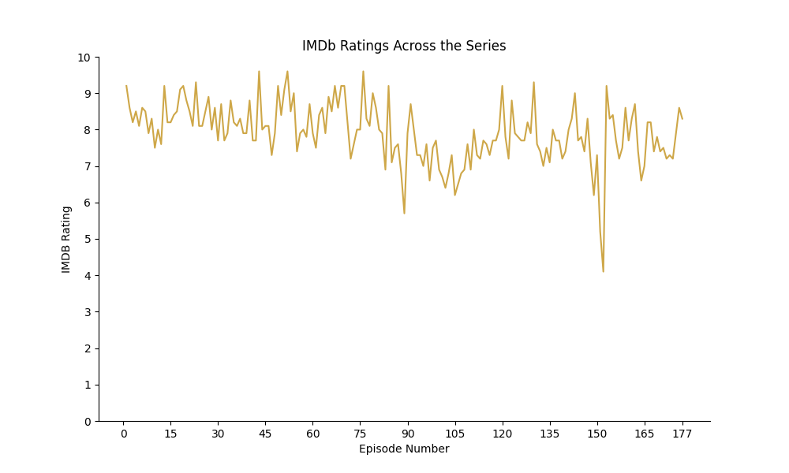  
**IMDB Ratig Across The Seasons**  
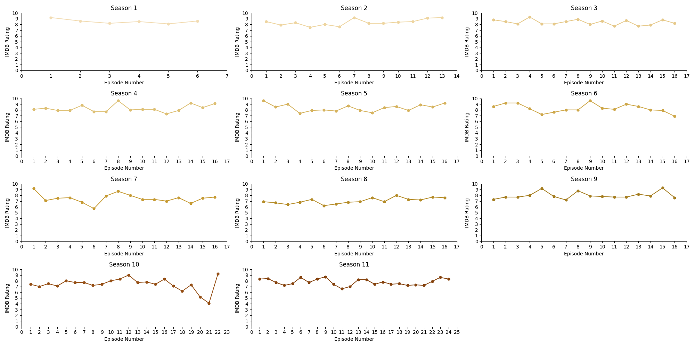  

**Observations:**
- the **average** rating for episodes was **7.92**
- the episode distribution was **symmetrical** with some outliers on the right side
- the best rated episodes were **5x1, 4x8 and 6x9** with rating of **9.6**
- the worst rated episodes were **10x21** with **4.1**, **10x20** with **5.2** and **7x6** with **5.7**
- the rating held quiet **stable** across the series with some drops in quality starting at episode **90**
- there were **no obvious patterns** in ratings during seasons from charts
- there were noticably poorly reviewed episodes in seasons **7,10 and 11** compared to other seasons
- the average ratings of seasons were decreasing until season **9**, when it increased again compared to the first season
- seasons **7** and **10** had significantly larger gaps between the best and worst-rated episodes than the rest of the seasons

### US Viewership
The second important metric, even more important than IMDb ratings, is viewership.  
I analyzed the following aspects associated with US viewership:
- average viewership of the series
- viewership distribution
- best and worst viewed episodes
- viewership across the series
- viewership in seasons
- changes in viewership throughout seasons and the series as a whole
- average viewership of the seasons, including gaps between the best and worst episodes


**Average US Viewership**
```python
# Average viewership
print(twd_dataset['us_viewers'].mean().round(2))

Output:
8137966.09
```
**Average US Viewership Per Season**  
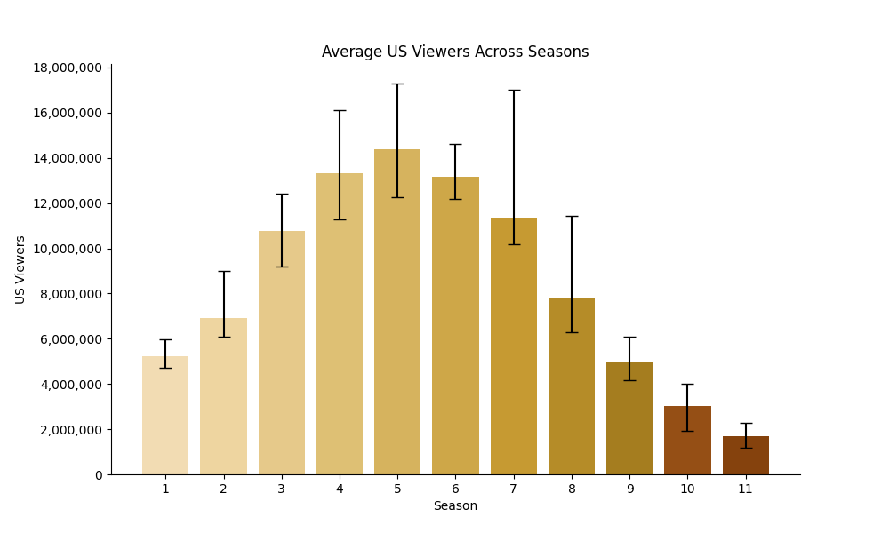  

**US Viewership Distribution**

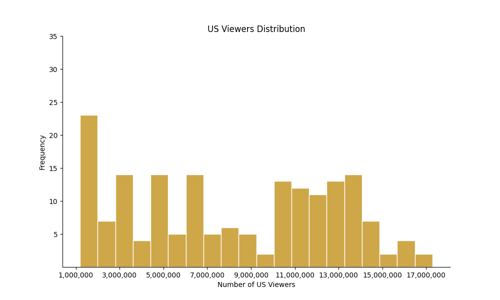  

**Please Note:** Unlike with IMDb ratings, it wasn't necessary to adjust the selection of top and worst viewed episodes based on the number of viewers. However, to maintain consistency, I decided to stick with the top 15 episodes from each group. 

**Best Viewed Episodes**  
```python
| Season | Episode Number in Season | Title                               | Original Air Date | IMDb Rating | US Viewers |
|--------|--------------------------|-------------------------------------|-------------------|-------------|------------|
| 5      | 1                        | No Sanctuary                        | 2014-10-12        | 9.6         | 17,290,000 |
| 7      | 1                        | The Day Will Come When You Won't Be | 2016-10-23        | 9.2         | 17,030,000 |
| 4      | 1                        | 30 Days Without an Accident         | 2013-10-13        | 8.1         | 16,110,000 |
| 5      | 16                       | Conquer                             | 2015-03-29        | 9.2         | 15,780,000 |
| 4      | 9                        | After                               | 2014-02-09        | 8.0         | 15,760,000 |
| 4      | 16                       | A                                   | 2014-03-30        | 9.1         | 15,680,000 |
| 5      | 9                        | What Happened and What's Going On   | 2015-02-08        | 7.9         | 15,640,000 |
| 5      | 2                        | Strangers                           | 2014-10-19        | 8.5         | 15,140,000 |
| 5      | 8                        | Coda                                | 2014-11-30        | 8.7         | 14,810,000 |
| 6      | 1                        | First Time Again                    | 2015-10-11        | 8.6         | 14,630,000 |
| 5      | 13                       | Forget                              | 2015-03-08        | 7.9         | 14,530,000 |
| 5      | 4                        | Slabtown                            | 2014-11-02        | 7.4         | 14,520,000 |
| 5      | 12                       | Remember                            | 2015-03-01        | 8.6         | 14,430,000 |
| 6      | 16                       | Last Day on Earth                   | 2016-04-03        | 6.9         | 14,190,000 |
| 5      | 6                        | Consumed                            | 2014-11-16        | 8.0         | 14,070,000 |

```
**Worst Viewed Episodes**
```python
| Season | Episode Num in Season | Title               | Original Air Date | IMDb Rating | US Viewers |
|--------|-----------------------|---------------------|-------------------|-------------|------------|
| 11     | 17                    | Lockdown            | 2022-10-02        | 7.4         | 1190000    |
| 11     | 18                    | A New Deal          | 2022-10-02        | 7.5         | 1350000    |
| 11     | 19                    | Variant             | 2022-10-09        | 7.2         | 1360000    |
| 11     | 20                    | What's Been Lost    | 2022-10-16        | 7.3         | 1360000    |
| 11     | 22                    | Faith               | 2022-10-30        | 7.9         | 1390000    |
| 11     | 23                    | Family              | 2022-11-06        | 8.6         | 1470000    |
| 11     | 21                    | Outpost 22          | 2022-10-23        | 7.2         | 1500000    |
| 11     | 14                    | The Rotten Core     | 2022-03-20        | 8.2         | 1550000    |
| 11     | 12                    | The Lucky Ones      | 2022-03-06        | 7.0         | 1580000    |
| 11     | 10                    | New Haunts          | 2022-02-20        | 7.4         | 1600000    |
| 11     | 16                    | Acts of God         | 2022-04-03        | 7.8         | 1610000    |
| 11     | 15                    | Trust               | 2022-03-27        | 7.4         | 1670000    |
| 11     | 11                    | Rogue Element       | 2022-02-27        | 6.6         | 1670000    |
| 11     | 9                     | No Other Way        | 2022-02-13        | 8.7         | 1760000    |
| 11     | 6                     | On the Inside       | 2021-09-19        | 8.6         | 1780000    |
```
**US Viewership Across The Series**  
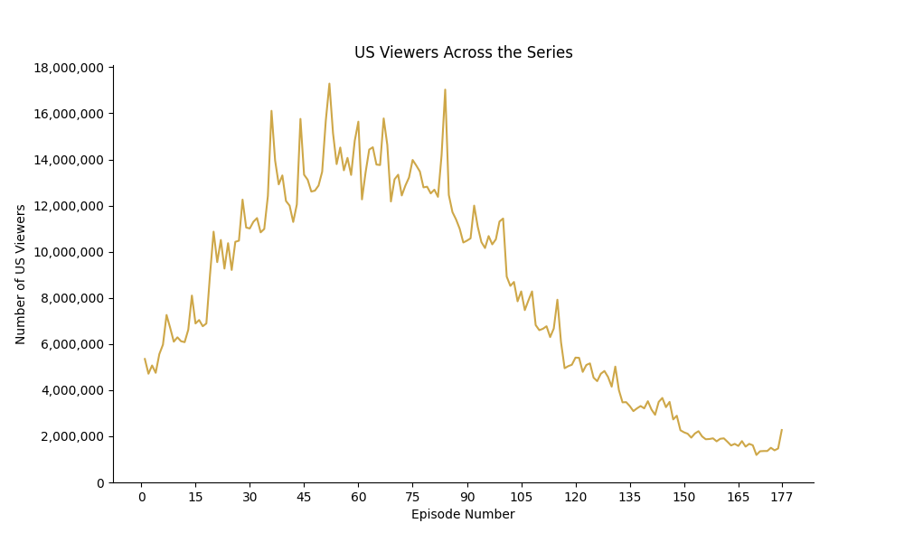  
**US Viewership Across The Seasons**  
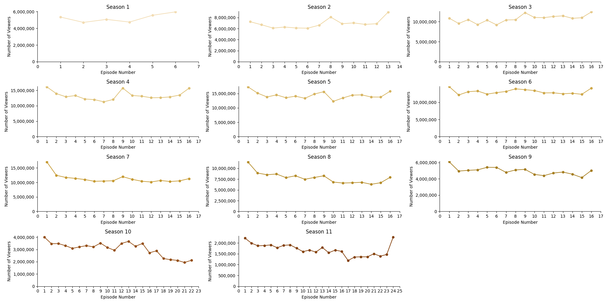  

**Observations:**
- average US viewership per episode was **8 137 966.09**
- best viewed episodes were **5x1** with **17 290 00** viewers, **7x1** with **17 030 000** viewers and **4x1** with **16 110 000** viewers
- worst viewed episodes were **11x17** with **1 190 00** viewers, **11x18** with **1 135 000** viewers and **11x19** with **1 136 000** viewers
- unlike IMDB ratings, viewership showed a sinusoidal tendency, increasing in the first **50** episodes and drastically decreasing from episode **90** onwards
- decrease in viewership may be attributed to the launch of **AMC+** on June 11th, 2020
- seasons **4**, **5** and **7** hhad significantly larger gaps between the best and worst-viewed episodes compared to the rest of the seasons
- it seemed to be some patterns in viewership over the seasons that require further analysis

### Release Date Trends
Every platform has its own model for releasing shows. Some prefer weekly releases, while others prefer releasing the entire season at once. I decided to investigate the release model used for **The Walking Dead**.

```python
# Getting number of episodes for days of the week
twd_dataset['day_of_week'] = twd_dataset['original_air_date'].dt.weekday

days_of_week = ['Monday', 'Tuesday', 'Wednesday', 'Thursday', 'Friday', 'Saturday', 'Sunday']
twd_dataset['day_name'] = twd_dataset['day_of_week'].map(lambda x: days_of_week[x])

day_counts = twd_dataset['day_name'].value_counts()
print(day_counts)

Output:
Sunday      172
Thursday      5
Name: day_name, dtype: int64
```

```python
# Getting release date for episodes release at Thursday
unsual_air_date = 'Thursday'

display(twd_dataset[twd_dataset['day_name'] == unsual_air_date])

Output:
| season | episode_num_in_season | episode_num_overall | title          | directed_by   | written_by                              | original_air_date | us_viewers | imdb_rating | total_votes | episode_synopsis                                  | day_of_week | day_name |
|--------|-----------------------|---------------------|----------------|---------------|-----------------------------------------|-------------------|------------|-------------|-------------|---------------------------------------------------|-------------|----------|
| 10     | 16                    | 147                 | A Certain Doom | Greg Nicotero | Jim Barnes and Eli Jorné and Corey Reed | 2020-10-01        | 2730000    | 8.3         | 8369        | Beta engages the final battle of the Whisperer... | 3           | Thursday |
| 10     | 18                    | 149                 | Find Me        | David Boyd    | Nicole Mirante-Matthews                 | 2021-03-04        | 2260000    | 6.2         | 7570        | Daryl and Carol find an old cabin that takes D... | 3           | Thursday |
| 10     | 19                    | 150                 | One More       | Laura Belsey  | Erik Mountain and Jim Barnes            | 2021-03-11        | 2170000    | 7.3         | 7477        | With Maggie's map, Gabriel and Aaron search fo... | 3           | Thursday |
| 10     | 20                    | 151                 | Splinter       | Laura Belsey  | Julia Ruchman and Vivian Tse            | 2021-03-18        | 2110000    | 5.2         | 8747        | Eugene, Ezekiel, Yumiko, and Princess are capt... | 3           | Thursday |
| 10     | 21                    | 152                 | Diverged       | David Boyd    | Heather Bellson                         | 2021-03-25        | 1940000    | 4.1         | 10179       | Daryl and Carol come to a fork in the road and... | 3           | Thursday |
```

**Observations:**
- **172** episodes aired on **Sunday**
- **5** episodes aired on **Thursday**
- episodes that aired on Thursday were: **10x16, 10x18, 10x19, 10x20** and **10x21**

### Directors Within The Series
An important part of each movie and show are the directors. These individuals give the screenplay the necessary form that we, as viewers, can see. In this part of my project.  
I analyzed the following aspects of directors' contributions to the show:
- directors with the most directed episodes
- best and worst directors

**Directors With Most Directed Episodes**  
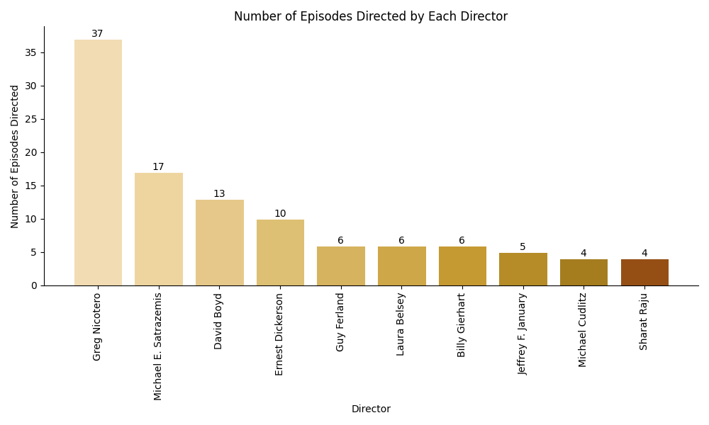  

**Please Note:**  
When reviewing the full list of directors and the number of episodes they worked on, I determined that to identify the best and worst directors based on average IMDb ratings, I needed to include those who had directed at least 3 episodes.

**Directors With Best Rated Episodes**
```python
# Creating list of directors with at least 3 episodes
directors_with_at_least_3_episodes = twd_dataset['directed_by'].value_counts()[twd_dataset['directed_by'].value_counts() >= 3].index

filtered_directors = twd_dataset[twd_dataset['directed_by'].isin(directors_with_at_least_3_episodes)]
```
```python
# Printing top 10 best rated directors
top_directors = filtered_directors['imdb_rating'].groupby(filtered_directors['directed_by']).mean().round(2).sort_values(ascending=False).nlargest(10)

print(top_directors)

Output:
directed_by
Michelle MacLaren     8.97
Guy Ferland           8.57
Ernest Dickerson      8.47
Billy Gierhart        8.25
Tricia Brock          8.23
Seith Mann            8.23
Michael Slovis        8.13
Sharat Raju           8.07
Greg Nicotero         8.04
Jeffrey F. January    7.74
Name: imdb_rating, dtype: float64
```

**Directors With Worst Rated Episodes**
```python
# Printing top 10 worst rated directors
worst_directors = filtered_directors['imdb_rating'].groupby(filtered_directors['directed_by']).mean().round(2).sort_values(ascending=False).nsmallest(10)

print(worst_directors)

Output:
directed_by
Michael Cudlitz          7.15
Dan Liu                  7.40
David Boyd               7.42
Rosemary Rodriguez       7.53
Michael E. Satrazemis    7.68
Alrick Riley             7.70
Laura Belsey             7.73
Jeffrey F. January       7.74
Greg Nicotero            8.04
Sharat Raju              8.07
Name: imdb_rating, dtype: float64
```

**Observations:**  
- the directors with most directed episodes were **Greg Nicotero** with **37**, **Michael E.Satrazemis** with **17** and **David Boyd** with **13**
- the best rated directors were **Michelle MacLaren** with **8.97**, **Guy Ferland** with **8.57** and **Ernest Dickerson** with **8.47**
- the worst rated directors were **Michael Cudlitz** with **7.15**, **Dan Liu** with **7.40** and **David Boyd** with **7.42**

### Writers Within The Series
While directors are an important part of each movie and show, writers are even more crucial. These individuals create the screenplay, which is then brought to life by the directors. In this part of my project, I analyzed the following aspects of writers' contributions to the show:
- writers with the most written episodes
- best and worst writers

**Writerss With Most Rittend Episodes**  
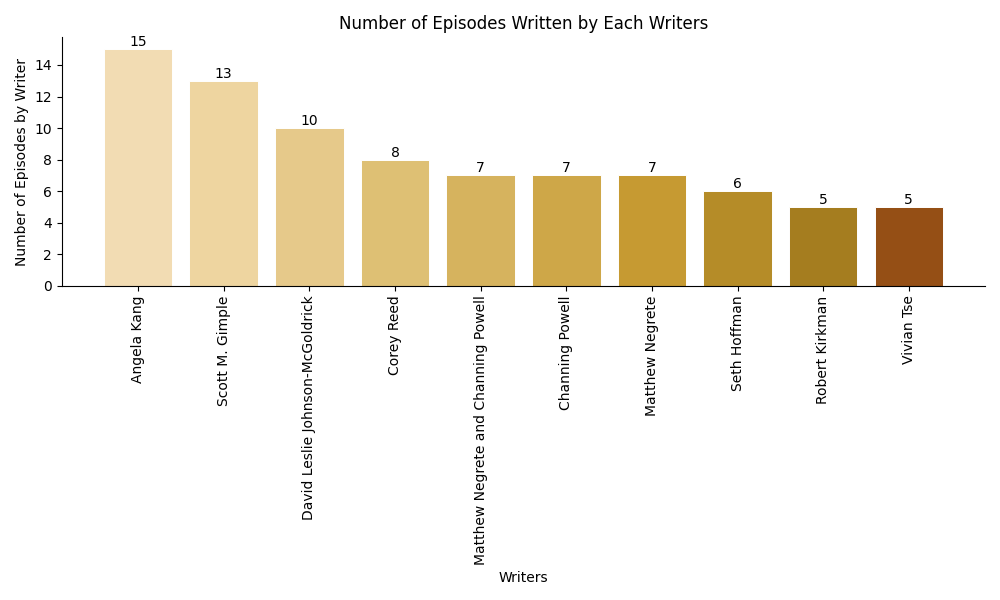  

**Please Note:**  
I applied the same logic as with directors. Only writers or writer teams with at least 3 episodes were eligible for this analysis.

**Writers With Best Rated Episodes**
```python
# Creating list of writers with at least 3 episodes
writers_with_at_least_3_episodes = twd_dataset['written_by'].value_counts()[twd_dataset['written_by'].value_counts() >= 3].index

filtered_writers = twd_dataset[twd_dataset['written_by'].isin(writers_with_at_least_3_episodes)]
```
```python
# Printing top 10 best rated writerss
top_writers = filtered_writers['imdb_rating'].groupby(filtered_writers['written_by']).mean().round(2).sort_values(ascending=False).nlargest(10)

print(top_writers)

Output:
written_by
Seth Hoffman                           8.93
Scott M. Gimple                        8.45
Robert Kirkman                         8.36
Nichole Beattie                        8.27
Glen Mazzara                           8.25
Scott M. Gimple and Matthew Negrete    8.23
Angela Kang                            7.95
Evan Reilly                            7.95
Kevin Deiboldt                         7.90
Channing Powell                        7.87
Name: imdb_rating, dtype: float64
```

**Writers With Worst Rated Episodes**
```python
# Printing top 10 worst rated writers
worst_writers = filtered_writers['imdb_rating'].groupby(filtered_writers['written_by']).mean().round(2).sort_values(ascending=False).nsmallest(10)

print(worst_writers)

Output:
written_by
Heather Bellson                        6.40
Nicole Mirante-Matthews                7.05
Eddie Guzelian                         7.30
Vivian Tse                             7.36
Julia Ruchman                          7.43
Matthew Negrete and Channing Powell    7.47
David Leslie Johnson-McGoldrick        7.57
Jim Barnes                             7.57
Corey Reed                             7.78
Matthew Negrete                        7.80
Name: imdb_rating, dtype: float64
```

**Observations:**  
- writers with the most written episodes were **Angela Kang** with **15**, **Scott M.Gimple** with **13** and **David Leslie Johnson-McGoldrick** with **10**
- best rated writers were **Seth Hoffman** with an average ratig of **8.93**, **Scott M. Gimple** with **8.45** and **Robert Kirkman** with **8.36**
- worst rated writers were **Heather Bellson** with an average rating of **6.40**, **Nicole Mirante-Matthews** with **7.05** and **Eddie Guzelian** with **7.30**

### Episode Synopsis
Because this is an exploratory analysis project, I didn't want to go beyond the exploratory phase. However, I wanted to utilize the episode synopsis column in some way. Therefore, I created a **word cloud** from the words in all episode synopses.

  

## Conclusion And Future Work
I aimed to conduct a comprehensive exploratory analysis of The Walking Dead series. I examined various aspects such as episode distribution, IMDb rating trends, US viewership trends, and more. This analysis revealed a wealth of information and insights about the series that are now easily accessible.  

However, there is still much to explore in the future. Future analyses could investigate the relationships between IMDb ratings and viewership trends or even apply NLP techniques to extract interesting insights from the episode synopses. This is just a glimpse of what this data could reveal in the future.

## Acknowledgement
Thank you for taking the time to explore this analysis with me. The fact that you've come to the end means a lot to me. I hope you found the insights as intriguing as I did, and that this project has sparked your curiosity to further explore this dataset or one of your choice.

## Used Sources
https://www.kaggle.com/datasets/bcruise/the-walking-dead-episodes/data  
https://comicbook.com/thewalkingdead/news/the-walking-dead-season-9-logo-credits-decay-hope/
